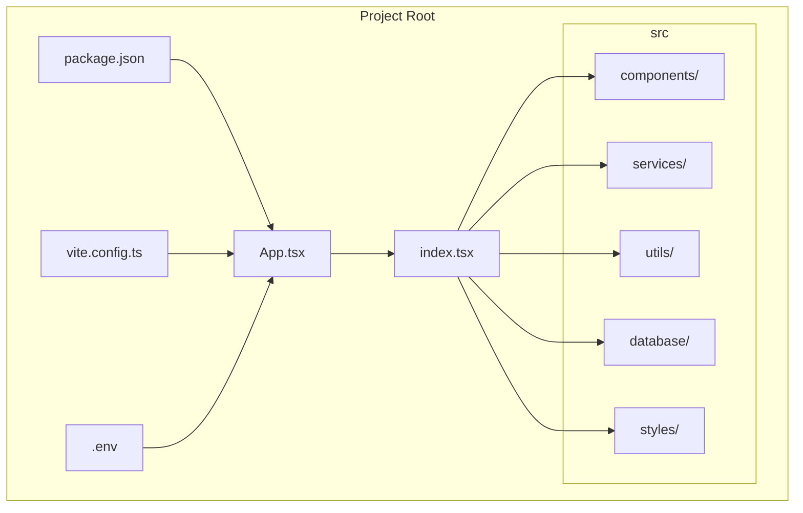

# Cohort‑new Codebase Overview



The diagram shows the high‑level structure:
- **App.tsx / index.tsx** – entry points for the React application.
- **components/** – reusable UI components.
- **services/** – API wrappers and business‑logic services.
- **utils/** – helper functions and shared utilities.
- **database/** – schema definitions / migration scripts.
- **styles/** – Tailwind configuration and global CSS.
- **package.json**, **vite.config.ts** – project and build configuration.
- **.env** – environment variables used at runtime.
```
